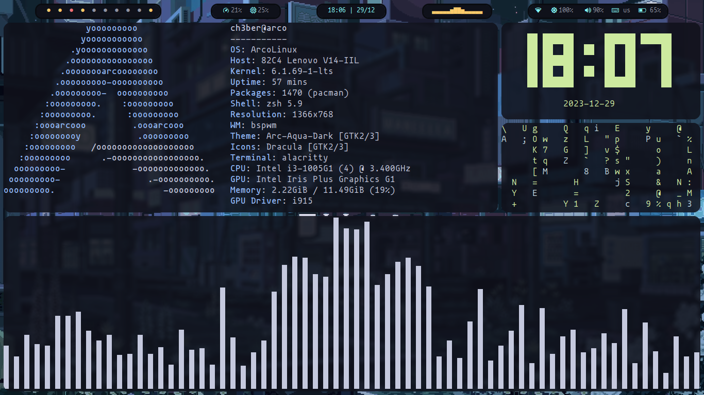
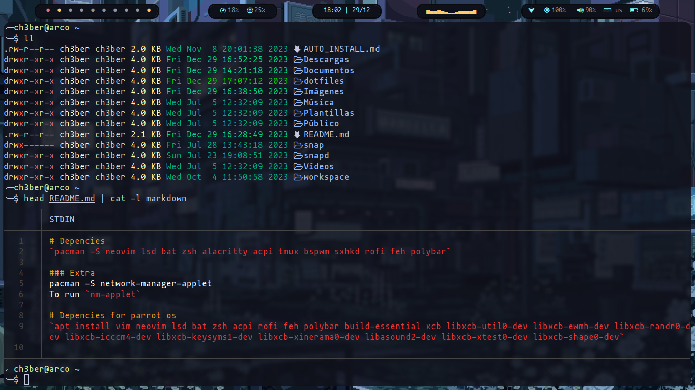

# Screenshots





# Depencies

`pacman -S stow neovim lsd bat zsh alacritty acpi tmux bspwm sxhkd rofi rofi-bluetooth-git feh polybar`

### Extra

pacman -S network-manager-applet
To run `nm-applet`

# Depencies for parrot os

`apt install vim neovim lsd bat zsh acpi rofi feh polybar build-essential xcb libxcb-util0-dev libxcb-ewmh-dev libxcb-randr0-dev libxcb-icccm4-dev libxcb-keysyms1-dev libxcb-xinerama0-dev libasound2-dev libxcb-xtest0-dev libxcb-shape0-dev`

# Fonts

Mononoki Nerd Font
Ubuntu Mono Nerd Font

# Install

`stow -v -t "$HOME" alacritty bspwm nvim picom polybar sxhkd zsh`

# ZSH config

## Oh My Zsh

I like use oh my zsh like plugin manager.

**What is?**
"Oh My Zsh is a delightful, open source, community-driven framework for managing your Zsh configuration." `https://ohmyz.sh`

## Theme

Set the theme with `ZSH_THEME="bira"`

## Plugins

### How to activate the plugins

Into the `~/.zshrc` file search for `plugins=(plugin-name another-plugin)`

[zsh-syntax-highlighting](https://github.com/zsh-users/zsh-syntax-highlighting)
`git clone https://github.com/zsh-users/zsh-syntax-highlighting.git ${ZSH_CUSTOM:-~/.oh-my-zsh/custom}/plugins/zsh-syntax-highlighting`

[zsh-autosuggestions](https://github.com/zsh-users/zsh-autosuggestions)
`git clone https://github.com/zsh-users/zsh-autosuggestions ${ZSH_CUSTOM:-~/.oh-my-zsh/custom}/plugins/zsh-autosuggestions`

[you-should-use](https://github.com/MichaelAquilina/zsh-you-should-use)
`git clone https://github.com/MichaelAquilina/zsh-you-should-use.git $ZSH_CUSTOM/plugins/you-should-use`

### Alias

```
alias ls=/bin/lsd
alias cat=/bin/batcat
alias szsh="source ~/.zshrc"
```

# Alacritty

### Config

# Install manual bspwm and sxhkd

```
git clone https://github.com/baskerville/bspwm.git
git clone https://github.com/baskerville/sxhkd.git
```

`mkdir ~/.config/bspwm
mkdir ~/.config/sxhkd`

## polybar

Depencies `cava` for sound visualizer

### Wlan

list your cards
`iwconfig`

set your card in
`interface = wlp0s20f3`

### backlight

sudo usermod -a -G video username

**Use the following command to list available cards:**
`ls -1 /sys/class/backlight/`

sudo chmod g+w /sys/class/backlight/YOUR_CARD/brightness
chown root:video /sys/class/backlight/YOUR_CARD/brightness

# APPs

spotify
brave
notion
nordpass
vscode
vlc
libreoffice
postman
discord
