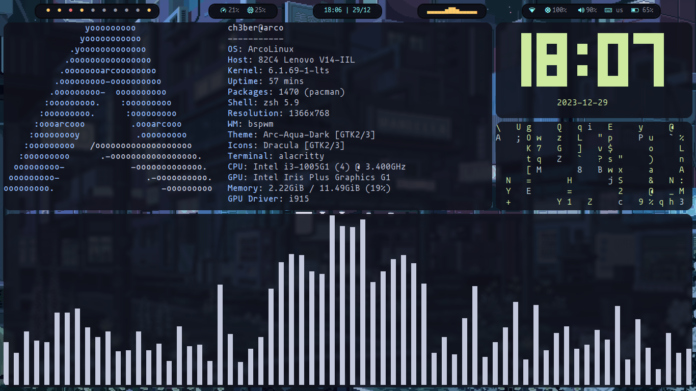
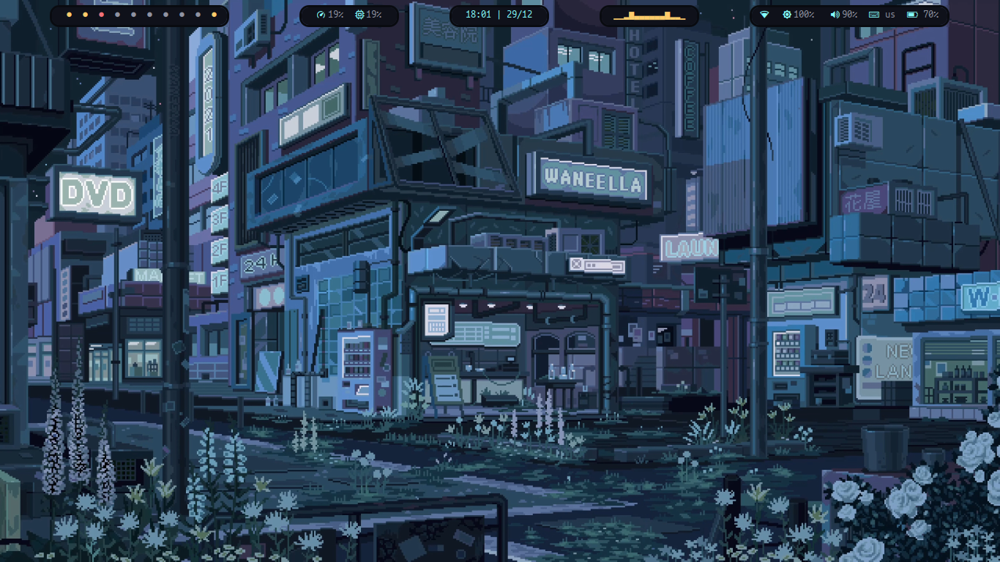
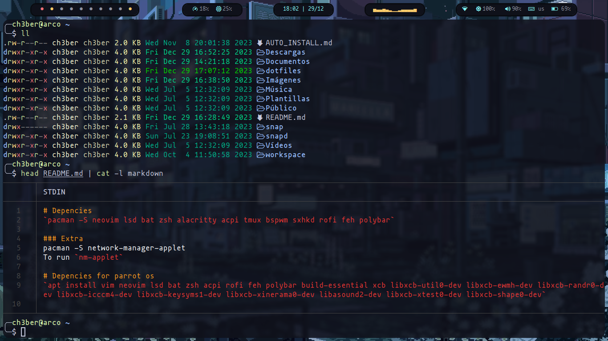

# Screenshots





# Quick Install (Arch Linux)

```bash
bash <(curl -sL https://raw.githubusercontent.com/ch3ber/dotfiles/main/install_dotfiles.sh)
```

The installer is interactive — it lets you choose which packages to install and applies the dotfiles with stow.

# Manual Install

### Dependencies

For bspwm (X11):
```
pacman -S spectacle stow lsd bat zsh alacritty acpi tmux bspwm sxhkd rofi feh polybar picom xclip
```

For hyprland (Wayland):
```
pacman -S hyprland hyprlauncher dunst waybar stow lsd bat zsh alacritty tmux grim slurp wl-clipboard
```

### Fonts

Mononoki Nerd Font
Ubuntu Mono Nerd Font

### Stow

For bspwm:
`stow -v -t "$HOME" alacritty bspwm picom polybar sxhkd zsh`

For hyprland:
`stow -v -t "$HOME" alacritty hyprland waybar zsh`

# ZSH config

## Oh My Zsh

I like use oh my zsh like plugin manager.

**What is?**
"Oh My Zsh is a delightful, open source, community-driven framework for managing your Zsh configuration." `https://ohmyz.sh`

## Theme

Set the theme with `ZSH_THEME="bira"`

## Plugins

### How to activate the plugins

Into the `~/.zshrc` file search for `plugins=(plugin-name another-plugin)`

[zsh-syntax-highlighting](https://github.com/zsh-users/zsh-syntax-highlighting)
`git clone https://github.com/zsh-users/zsh-syntax-highlighting.git ${ZSH_CUSTOM:-~/.oh-my-zsh/custom}/plugins/zsh-syntax-highlighting`

[zsh-autosuggestions](https://github.com/zsh-users/zsh-autosuggestions)
`git clone https://github.com/zsh-users/zsh-autosuggestions ${ZSH_CUSTOM:-~/.oh-my-zsh/custom}/plugins/zsh-autosuggestions`

[you-should-use](https://github.com/MichaelAquilina/zsh-you-should-use)
`git clone https://github.com/MichaelAquilina/zsh-you-should-use.git $ZSH_CUSTOM/plugins/you-should-use`

### Alias

```
alias ls=/bin/lsd
alias cat=/bin/batcat
alias szsh="source ~/.zshrc"
```

# Alacritty

### Config

# Install manual bspwm and sxhkd

```
git clone https://github.com/baskerville/bspwm.git
git clone https://github.com/baskerville/sxhkd.git
```

`mkdir ~/.config/bspwm
mkdir ~/.config/sxhkd`

## polybar

Depencies `cava` for sound visualizer

### Wlan

list your cards
`iwconfig`

set your card in
`interface = wlp0s20f3`

### backlight

sudo usermod -a -G video username

**Use the following command to list available cards:**
`ls -1 /sys/class/backlight/`

sudo chmod g+w /sys/class/backlight/YOUR_CARD/brightness
chown root:video /sys/class/backlight/YOUR_CARD/brightness

# APPs

spotify
brave
notion
nordpass
vscode
vlc
libreoffice
postman
discord
